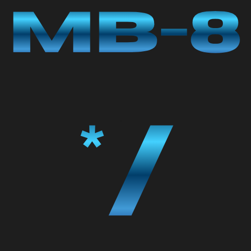

<div align="center">

# 🛡️ MechBit-8 (MB-8)
### Cryptographic Engine



[](#)
[](#)
[](#)
[](#)
[](#)
[](#)
[](#)
[](#)

</div>

---

> ### ⚠️ CRITICAL WARNING
> **DON'T MISUSE THIS. THE CREATOR ISN'T RESPONSIBLE FOR ANY DAMAGES.**
> This tool is deployed strictly for data masking, localized verification, and structural obfuscation evaluation. Any unauthorized deployment, malicious traffic simulation, or damage caused by improper pipeline usage is entirely on the end-user.

---

## 📦 Distribution Manifest

[](#)
[](#)

To maintain the architectural integrity and proprietary defense mechanisms of the **MB-8 Engine**, the source infrastructure remains closed. This repository contains only the finalized, compiled runtime deployment components:

* **`mb8.exe`** — The fully armed, standalone Windows console executable compiled via the PyInstaller pipeline. Includes the 2,000-round SHA-256 KDF matrix, shifting `RotorChain` parity machine, and live CRC-32 trailer validation.
* **`example.mb8`** — A pre-encoded, key-seeded target payload showcasing the signature ASCII symbol stream and randomized chaff injection.

---

## ⚡ Quick Start Deployment

[](#)
[](#)

Since this is a portable command-line tool, drop `mb8.exe` into your environment directory or local system path and interface with it directly via CMD or PowerShell.

### 1. Test the Decoding Pipeline

Attempt to unwrap the provided example payload using your passphrase:

```bash
mb8.exe --decode --file example.mb8
```

### 2. Test the Encoding Pipeline

Mask a localized text file or configuration string into text-safe symbol static:

```bash
mb8.exe --encode --file example.mb8
```

---

## 🛠️ Core Engine Specs

[](#)
[](#)
[](#)

| Module | Description |
|---|---|
| 🌀 **Entropy Generation** | Shifting integer state parameters (`pos_a`, `pos_b`, `pos_c`) ensuring non-linear token mapping per bit. |
| 🔐 **Brute-Force Mitigation** | Key stretching via an iterative 2,000-round cryptographic hashing block before initialization vectors are bound. |
| ✅ **Integrity Seal** | Appends an automatic hardware-speed cyclic redundancy check to dump corrupted payloads instantly on execution. |

---

<div align="center">


</div>
